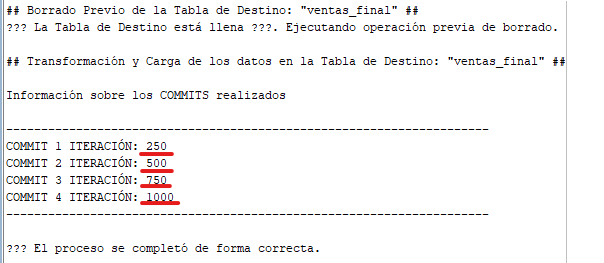
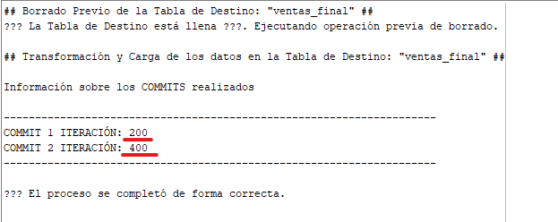

## Documentation of the ETL Process from a CSV file with PL/SQL.


### 📝 Description:
Small project developed in the **PL/SQL** procedural language. It consists of a process of **extraction**, **transformation** and **data loading** of a **CSV file** and the **automated export** of the
information transformed to a **new CSV file**.

### 🛠️ Environment & Version:
- **Language**: PL/SQL.
- **Database**: Oracle Database 21c.
- **Tools/Technologies Used**:
  
  - `External Tables.`
  - `Bulk Collect.`
  - `UTL_FILE.`
  - `DBMS_SCHEDULER.`
    
- **Operating System**: Windows 10.
- **IDE**: Oracle SQL Developer.

### 🎯 Objetives:
1. **Extract** the raw data from a **CSV file**, using: `External Table.`
2. Perform the necessary **transformations** on the extracted data.
3. Handling of possible **errors** and **transactions**.
4. **Load** the formatted data into a **destination table**.
5. **Export** the data loaded in the destination table in a **new CSV file**, using: `UTL_FILE.`
6. **Automate** the entire process with the help of: `DBMS_SCHEDULER.`

## ⚙ Initial Settings:
1. Create a new folder where the CSV file will be housed, in the following path:
   
- `C:\app\SYSTEM_USER\product\21c\admin\xe\YOUR_NEW_FOLDER`

2. Then, I will register the directory in Oracle using the following command:
```sql
CREATE OR REPLACE DIRECTORY YOUR_NEW_FOLDER_ALIAS AS 'C:\app\SYSTEM_USER\product\21c\admin\xe\YOUR_NEW_FOLDER';
```
3. After that, it will be important to assign the appropriate directory permissions and move the CSV file to the create folder:
```sql
GRANT READ, WRITE ON DIRECTORY YOUR_NEW_FOLDER_ALIAS TO YOUR_ORACLE_USER;
```
4. Verify that the directory has been registered correctly:
```sql
 SELECT * FROM ALL_DIRECTORIES WHERE DIRECTORY_NAME = 'YOUR_NEW_FOLDER_ALIAS';
```
## 📋 Code Table of Contents:

| Component | Name | Function |
|----------|----------|----------|
| **External Table** | *ventas_ext*. | Load data from csv file. |
| **Destination Table** | *ventas_final*. | Load the transformed data. |
| **Sub-Procedure** | *format_data*. | format the data type of the external table. |
| **Sub-Procedure** | *adjust_mount*. | Clean dirty values ​​from the amount. |
| **Sub-Procedure** | *international_category*. | Determine the Category according to the country. |
| **Main Procedure** | *run_etl_process*. | Encapsulate the main logic and previous subprocedures. |
| **Procedure** | *ExportFormatDataToNew_CSV_File*. | Export the information transformed and loaded into the destination table to a new csv file. |
| **Job** | *RUN_ETL_JOB_AND_EXPORT_FORMAT_DATA*. | Automate the execution and export process of the ETL process. |

## 💻 Code explanation:

### External table and Destination table creation.

1. This part of the code, I create the **External Table** for the `ventas.csv` file. I specify the columns of the csv file, the access parameters and the location of the csv file.

```sql
 CREATE TABLE ventas_ext
(
ventas_id NUMBER(4),
fecha CHAR(10),
artista_id NUMBER(10),
monto NUMBER(10,2),
pais_origen VARCHAR(50)
)
ORGANIZATION EXTERNAL
(
 TYPE ORACLE_LOADER
 DEFAULT DIRECTORY ETL_FILES_DIR
 ACCESS PARAMETERS (
   RECORDS DELIMITED BY NEWLINE
   CHARACTERSET WE8ISO8859P1
   FIELDS TERMINATED BY ','
   MISSING FIELD VALUES ARE NULL
   (
   ventas_id CHAR(4),
   fecha CHAR(10),
   artista_id CHAR(10),
   monto CHAR(10),
   pais_origen CHAR(50)
 )
 )
 LOCATION ('ventas.csv')
)
REJECT LIMIT UNLIMITED;
```
2. I create the destination table: `ventas_final`, adding an additional column: `category`.
   
```sql
CREATE TABLE ventas_final(
    ventas_final_id NUMBER PRIMARY KEY,
    fecha DATE,
    artista_id NUMBER,
    monto NUMBER,
    pais_origen VARCHAR2(50),
    categoria VARCHAR2(20) 
)
```
3. To avoid oracle error: `ORA-10027` (buffer overflow), run:
   
```sql
EXECUTE dbms_session.reset_package;
SET SERVEROUTPUT ON SIZE UNLIMITED
EXECUTE sys.dbms_output.enable(NULL);
CLEAR SCREEN
```
4. Perform a simple query to check the information in the **External Table**. 
 
```sql   
select * from ventas_ext;
```
5. Using this query you can see the information of the **External Table** in more detail:
   
```sql   
   SELECT column_name, data_type, data_length, data_precision, data_scale
   FROM user_tab_columns
   WHERE table_name = 'VENTAS_EXT';
```
### The three subprocedures of the code:
  - **Firts Subprocedure**: `format_data`.
    
1. I create and define procedure parameters.

```sql   
create or replace procedure format_data (
    p_ventas_id_sin_convertir IN OUT ventas_ext.ventas_id%type,
    p_cadena_fecha_sin_convertir IN OUT ventas_ext.fecha%type,
    p_artista_id_sin_convertir IN OUT ventas_ext.artista_id%type,
    p_monto_sin_convertir IN OUT ventas_ext.monto%type)   
as
```
2. Here I am declaring the **boolean constants** that I will use in the **IF condition**.

```sql   
 v_condicion CONSTANT BOOLEAN :=
 p_ventas_id_sin_convertir IS NOT NULL 
 AND p_cadena_fecha_sin_convertir IS NOT NULL 
 AND p_artista_id_sin_convertir IS NOT NULL
 AND p_monto_sin_convertir IS NOT NULL;
```
3. In the body of the procedure I evaluate that **no parameter is null**, and **if true, I report the data conversion**.  

```sql   
BEGIN
    IF v_condicion THEN
      p_ventas_id_sin_convertir := TO_NUMBER(p_ventas_id_sin_convertir);
      
      p_cadena_fecha_sin_convertir := TO_DATE(p_cadena_fecha_sin_convertir, 'YYYY-MM-DD');

      p_artista_id_sin_convertir := TO_NUMBER(p_artista_id_sin_convertir);

      p_monto_sin_convertir := TO_NUMBER(p_monto_sin_convertir);
    END IF;
END;
/
```
  - **Second Subprocedure**: `adjust_mount`.
1. I create and define procedure parameters. **Remove possible decimal values** ​​from the beginning using: `trunc(arg1, integer)` in the in out parameter: `p_monto`.  

```sql   
create or replace procedure adjust_amount (p_monto IN OUT NUMBER)   
as
BEGIN
 p_monto := trunc(p_monto,0);
```
2. Then I handle possible negative values ​​first. Depending on its value, I assign a **default number**: `0`, or convert it to a **positive** number using: `abs(argument)`.

```sql   
IF p_monto < -999999 THEN
 p_monto := 0;
ELSIF p_monto >= -999999 AND p_monto <= -1 THEN
 p_monto := ABS(p_monto); 
END IF;
```
3. Secondly, I handle positive values, and assign a default number: `999999` to the in out parameter: `p_amount`, **if the value exceeds the condition threshold**. 

```sql   
IF p_monto > 999999 THEN
 p_monto := 999999;
END IF;
END; 
/
```
  - **Third Subprocedure**: `international_category`.
1. I create and define procedure parameters: `p_pais_origen`, and the out parameters: `p_categoria `. Later, declare and assing on then variable: `v_categoría_internacional` and `v_categoría_nacional` the correspondent values. (`Internacional`, `Nacional`). 

```sql   
create or replace procedure international_category (p_pais_origen VARCHAR2, p_categoria OUT VARCHAR2)   
as
v_categoría_internacional VARCHAR2(20) := 'Internacional';
v_categoría_nacional VARCHAR2(20) := 'Nacional';
BEGIN
```
2. In the body of procedure, I define a conditional section, and im evaluate the follow logic: if the country is neither `España` nor `México`, assign in output parameter: `p_categoria` this variable: `v_categoría_internacional`.  
   Otherwise, I save: 'v_categoría_nacional' in output parameter: `p_categoria`.              

```sql   
BEGIN
 IF p_pais_origen != 'España' AND p_pais_origen != 'México' THEN
    p_categoria := v_categoría_internacional;
 ELSE
    p_categoria := v_categoría_nacional;
 END IF;
END;
/
```  
### The Main Procedure: `run_etl_process`. 

In the declaration of this procedure, I am declaring the collection `artist_sales` from the external table: `ext_sales` and telling it 
make the data type the same using: `%rowtype`.

```sql 
CREATE OR REPLACE PROCEDURE run_etl_process 
IS
BEGIN
DECLARE 
-- Colección para la extracción de los datos la External Table:
   TYPE ventas_artistas IS TABLE OF ventas_ext%rowtype INDEX BY PLS_INTEGER;
```
This part corresponds to the program's **variable** and **constant** declaration block:

```sql
   VENTAS_ART ventas_artistas;
   v_categoría VARCHAR2(20);
   v_error BOOLEAN := FALSE;
   
   v_num_registros NUMBER := 0;
   v_contador_commit NUMBER := 0;
   v_num_commit NUMBER := 0;
   v_división_registros_entre_2 NUMBER;
   v_resultado_entre_2 NUMBER;
   v_división_registros_entre_4 NUMBER;
   v_resultado_entre_4 NUMBER;
   v_contador_commit_valor NUMBER := 0;
   
   RANGO_1 BOOLEAN := FALSE;
   RANGO_2 BOOLEAN := FALSE;
   CUATRO_COMMITS BOOLEAN := FALSE;
   DOS_COMMITS BOOLEAN := FALSE;
```
At the beginning of the program, I perform an extract of the loaded data from the csv file into the external table: `sales_ext`
and I use the statement: `BULK COLLECT INTO` to perform a massive load of information into the created collection. This is useful when
The volume of records in a table is too large and it is not optimal to process them one by one. 

Below I perform a prior deletion of the table to avoid duplicate data or non-updated data. First I check that the table is not empty.

```sql
BEGIN
   SELECT * BULK COLLECT INTO VENTAS_ART FROM ventas_ext;
   
   DBMS_OUTPUT.PUT_LINE('## Borrado Previo de la Tabla de Destino: ' || '"ventas_final" ##');
   select count(*) into v_num_registros from ventas_final;

   IF v_num_registros > 0 THEN
     DBMS_OUTPUT.PUT_LINE('La Tabla de Destino está llena. Ejecutando operación previa de borrado.');
    delete from ventas_final;
    ELSE
    DBMS_OUTPUT.PUT_LINE('??? La Tabla de Destino está vacía ???. Omitiendo operación previa de borrado.');
   END IF;
```
In this code block, I am capturing the **operation** and then the **result** of dividing the number of records by **4** and **2** 
what's in the table. This will be useful later to perform an operation: `COMMIT`, **every few records**, **depending on the range
of records in which the table is located**. As you can in the condition of the **boolean variables**: `RANGE_1` and `RANGO_2`.

```sql
    v_división_registros_entre_4 := v_num_registros / 4;
    v_división_registros_entre_2 := v_num_registros / 2;
    
    v_resultado_entre_4 := v_división_registros_entre_4;
    v_resultado_entre_2 := v_división_registros_entre_2;
    
    RANGO_1 := v_num_registros >= 1000 AND v_num_registros <= 10000;
    RANGO_2 := v_num_registros >= 100 AND v_num_registros <= 999;
```

Para este caso particular usaré el bucle: `FOR` en lugar de: `FORALL`, debido a que hay operaciones más complejas.

 ```sql   
    FOR i IN 1..VENTAS_ART.COUNT LOOP
      
    -- Set a SAVEPOINT to revert changes in case of error.
       SAVEPOINT iteracion_inicio;
       BEGIN
      -- 1. Transform to the correct data type (NUMBER & DATE) using the first subprocedure:
      format_data(VENTAS_ART(i).ventas_id, VENTAS_ART(i).fecha, VENTAS_ART(i).artista_id, VENTAS_ART(i).monto); 
      
      -- 2. Adjust the Amount (cleaning of values) using the second subprocedure:
     adjust_amount (VENTAS_ART(i).monto);
      
      -- 3. Assign the category: 'Internacional' or 'Nacional', as appropriate. using the third subprocedure:
      international_category(VENTAS_ART(i).pais_origen, v_categoría);
      
      -- 4. Loading data into the Destination Table: 'ventas_final'. Using the 'Insert Into' statement
     INSERT INTO ventas_final VALUES(
     VENTAS_ART(i).ventas_id, VENTAS_ART(i).fecha, 
     VENTAS_ART(i).artista_id, VENTAS_ART(i).monto, 
     VENTAS_ART(i).pais_origen, v_categoría);
```
To avoid doing a **COMMIT** for each iteration, **I evaluate dynamically based on the number of records
existing, every how many records to do it**. Well, if a **COMMIT** operation were performed for each record and I have **10,000** records,
**It would be 10,000 save operations to perform**, and this would not be optimal.

Therefore, within this part of the loop, I set a **counter for commits**. Below, **two boolean variables**, which I will use as part
of an if condition to evaluate whether the **counter is equal to the result of the register division**.

 ```sql
     v_contador_commit := v_contador_commit + i;
   
     CUATRO_COMMITS := v_contador_commit = v_división_registros_entre_4;
     DOS_COMMITS := v_contador_commit = v_división_registros_entre_2;
```
Before that, I establish a first input condition to verify that the table
has a number of records that is within the range specified by the boolean variables: `RANGE_1` or `RANGE_2`. 
Regardless of which one, well, that is evaluated in the following condition.

 ```sql
 IF RANGO_1 OR RANGO_2 THEN 
 ```
If it is met, the program moves on to this second evaluation. Here, it is evaluated that **if the number of records is found 
within the range specified in the boolean variable: `RANGE_1` and the commit counter is equal to the result of the log split
divided by 4**: (`FOUR_COMMITS := v_counter_commit = v_division_records_between_4;`) the **COMMIT** operation will be performed every (**x**) 
records according to the result of the division, until completed.

 ```sql
 IF RANGO_1 AND CUATRO_COMMITS THEN
    -- If this process did not generate any errors, I save the changes:
    COMMIT;
    v_contador_commit_valor := v_contador_commit;
    v_división_registros_entre_4 := v_división_registros_entre_4 + v_resultado_entre_4;
    v_num_commit := v_num_commit + 1;
    DBMS_OUTPUT.PUT_LINE('COMMIT ' || v_num_commit || ' ITERACIÓN: ' || v_contador_commit_valor);
 ```

Por ejemplo; Si la tabla tiene **1000 registros**, estos se dividirá entre **4**, y dará como resultado: `250`.

- En la **Primera Iteración**: el **primer COMMIT** se realizará cuando el contador de commit sea igual a este resultado.
- En la **Segunda Iteración**: el **segundo COMMIT** se realizará cuando el contador de commit sea igual a **500**. (250+250).
- En la **Tercera Iteración**: el **tercero COMMIT** se realizará cuando el contador de commit sea igual a **750**. (250+250+250).
- En la **Cuarta Iteración**: el **cuarto COMMIT** se realizará cuando el contador de commit sea igual a **1000**. (250+250+250+250).

 


Otherwise, if the number of records is within the range specified in the boolean variable: `RANGE_2`, and the counter 
of commits is equal to the result of dividing the number of records by 2: `DOS_COMMITS := v_commit_counter = v_division_registros_between_2;`,
I perform the save operation.

 ```sql
  ELSIF RANGO_2 AND DOS_COMMITS THEN
    -- If this process did not generate any errors, I save the changes:
    COMMIT;
    v_contador_commit_valor := v_contador_commit;
    v_división_registros_entre_2 := v_división_registros_entre_2 + v_resultado_entre_2;
    v_num_commit := v_num_commit + 1;
    DBMS_OUTPUT.PUT_LINE('COMMIT ' || v_num_commit || ' ITERACIÓN: ' || v_contador_commit_valor);
 ```
Por ejemplo; Si la tabla tiene **400 registros**, estos se dividirá entre **2**, y dará como resultado: `200`.

- En la **Primera Iteración**: el **primer COMMIT** se realizará cuando el contador de commit sea igual a este resultado.
- En la **Segunda Iteración**: el **segundo COMMIT** se realizará cuando el contador de commit sea igual a **400**. (200+200).

 

And if neither of the two are met, it sets the **commit counter** and the **number of commits** made to `0`.

 ```sql
   ELSE
   v_contador_commit := 0;
   v_num_commit := v_num_commit;     
   END IF;
 END IF; 
 ```
In case of error, handle it with an **exception** that reverts the changes and logs the error:

 ```sql
      EXCEPTION
        WHEN OTHERS THEN
                -- In case of error, the process is reverted again from the SAVEPOINT:
                ROLLBACK TO SAVEPOINT iteracion_inicio;
                v_error := TRUE;
                v_contador_commit := 0;
                v_num_commit := 0;  
    END; 
    END LOOP;
    DBMS_OUTPUT.PUT_LINE('---------------------------------------------------------------------');
 ```
If an error actually arose, for example, with some **subprocedure**, the variable: `v_error` will be set to: `TRUE`.
I'll evaluate this with an if condition, and print the corresponding message:

 ```sql
      IF v_error THEN
        DBMS_OUTPUT.PUT_LINE('');
        DBMS_OUTPUT.PUT_LINE('Surgió un error en alguna iteración del bucle.');
        ELSE
        DBMS_OUTPUT.PUT_LINE('');
        DBMS_OUTPUT.PUT_LINE('El proceso se completó de forma correcta.');
      END IF; 
END;
END;
```

### The export procedure: `ExportFormatDataToNew_CSV_File`.

Next I will encapsulate in a stored procedure the process of generating a **new CSV file called**: 'ventas_formateado.csv' 
with the information cleaned from the table: 'final_sales'. To then be able to program it through a **JOB**.

 ```sql
CREATE OR REPLACE PROCEDURE ExportFormatDataToNew_CSV_File 
IS
DECLARE
-- I indicate that it is a file type. 
ARCHIVO_VENTAS_FORMATEADO UTL_FILE.FILE_TYPE;
BEGIN

 /* Using: 'UTL_FILE.FOPEN', I indicate the opening of the file, indicating the alias of the directory, the csv file
    where I want to export the information. Finally, 'W' is assigned, to indicate that it is a write operation. */

ARCHIVO_VENTAS_FORMATEADO := UTL_FILE.FOPEN('ETL_FILES_DIR','ventas_formateado.csv','W');
```
With this **first loop**, I'm extracting the **column names**, and placing them
in the **header** of the **CSV file**, dynamically:

```sql
FOR i in (SELECT column_name FROM user_tab_columns WHERE table_name = 'VENTAS_FINAL')
LOOP
 UTL_FILE.PUT (ARCHIVO_VENTAS_FORMATEADO, i.COLUMN_NAME||',');
END LOOP;
UTL_FILE.PUT (ARCHIVO_VENTAS_FORMATEADO, CHR(10));
```
In this **second loop** I am inserting using the command: `UTL_FILE.PUT_LINE` each of the records of the destination table: `sales_final`
in the new CSV file: `formatted_sales.csv`.

```sql
FOR i in (select * from ventas_final order by artista_id asc)
LOOP
 UTL_FILE.PUT_LINE (ARCHIVO_VENTAS_FORMATEADO, i.VENTAS_FINAL_ID||','||i.FECHA||','||i.ARTISTA_ID||','||i.MONTO
                    ||','||i.PAIS_ORIGEN||','||i.CATEGORIA);
END LOOP;
--  I indicate the close of the file.
UTL_FILE.FCLOSE(ARCHIVO_VENTAS_FORMATEADO);
END;
/
```
