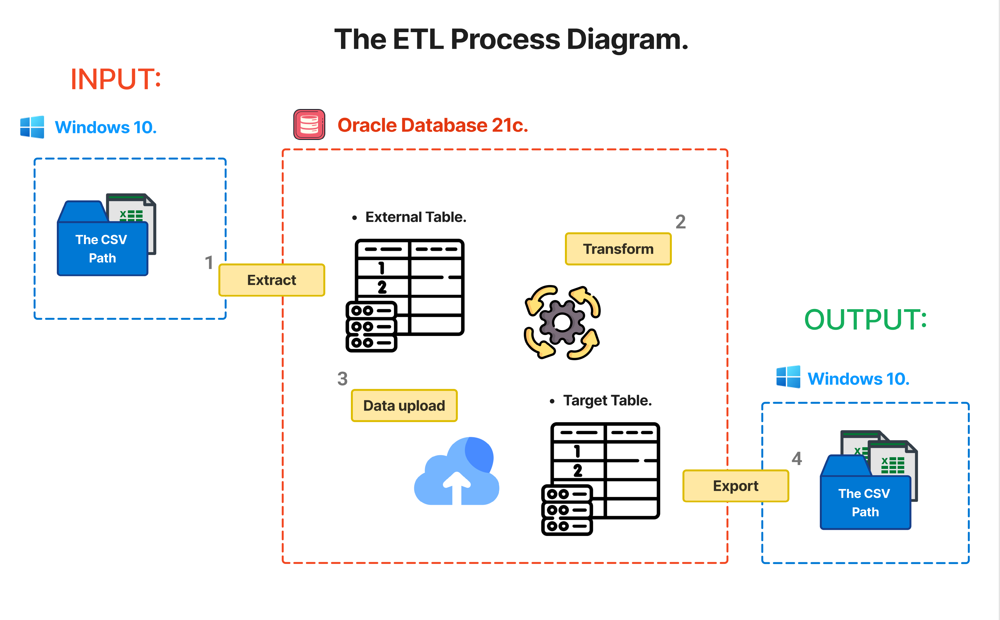

## Documentation of the ETL Process from a CSV file with PL/SQL.



### 📝 Description:
Small project developed in the **PL/SQL** procedural language. It consists of a process of **extraction**, **transformation** and **data loading** of a **CSV file** and the **automated export** of the
information transformed to a **new CSV file**.

### 🛠️ Environment & Version:
- **Language**: PL/SQL.
- **Database**: Oracle Database 21c.
- **Tools/Technologies Used**:
  
  - `External Tables.`
  - `Bulk Collect.`
  - `UTL_FILE.`
  - `DBMS_SCHEDULER.`
    
- **Operating System**: Windows 10.
- **IDE**: Oracle SQL Developer.

### 🎯 Objetives:
1. **Extract** the raw data from a **CSV file**, using: `External Table.`
2. Perform the necessary **transformations** on the extracted data.
3. Handling of possible **errors** and **transactions**.
4. **Load** the formatted data into a **destination table**.
5. **Export** the data loaded in the destination table in a **new CSV file**, using: `UTL_FILE.`
6. **Automate** the entire process with the help of: `DBMS_SCHEDULER.`

## ⚙ Initial Settings:
1. Create a new folder where the CSV file will be housed, in the following path:
   
- `C:\app\SYSTEM_USER\product\21c\admin\xe\YOUR_NEW_FOLDER`

2. Then, I will register the directory in Oracle using the following command:
```sql
CREATE OR REPLACE DIRECTORY YOUR_NEW_FOLDER_ALIAS AS 'C:\app\SYSTEM_USER\product\21c\admin\xe\YOUR_NEW_FOLDER';
```
3. After that, it will be important to assign the appropriate directory permissions and move the CSV file to the create folder:
```sql
GRANT READ, WRITE ON DIRECTORY YOUR_NEW_FOLDER_ALIAS TO YOUR_ORACLE_USER;
```
4. Verify that the directory has been registered correctly:
```sql
 SELECT * FROM ALL_DIRECTORIES WHERE DIRECTORY_NAME = 'YOUR_NEW_FOLDER_ALIAS';
```
## 📋 Code Table of Contents:

| Component | Name | function |
|----------|----------|----------|
| **External Table** | *ventas_ext*. |   |
| **Destination Table** |  |   |
| **Sub-Procedure** | *format_data*. |    |
| **Sub-Procedure** | *adjust_mount*. |  |
| **Sub-Procedure** | *international_category*. |   |
| **Main Procedure** | *run_etl_process*. |   |
| **Procedure** | *ExportFormatDataToNew_CSV_File*.  |   |
| **Job** | *RUN_ETL_JOB_AND_EXPORT_FORMAT_DATA*. |   |


